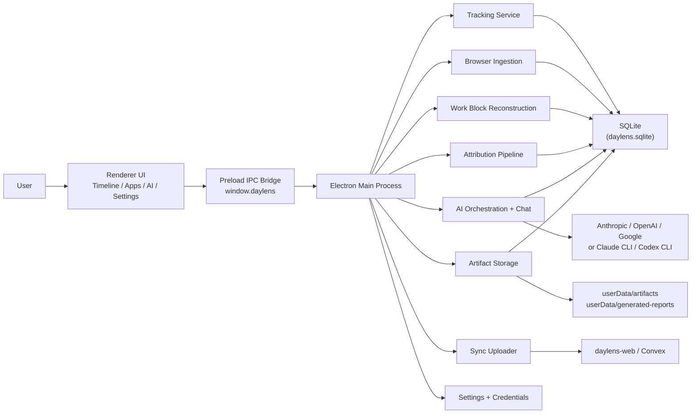
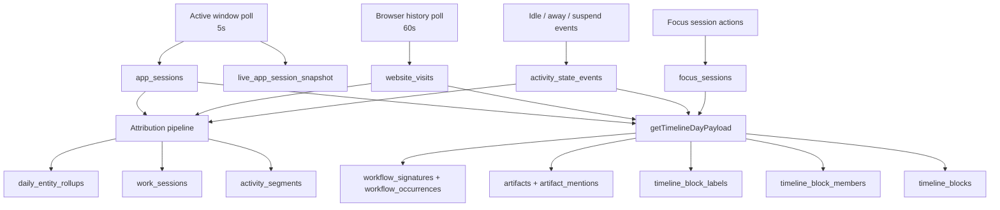
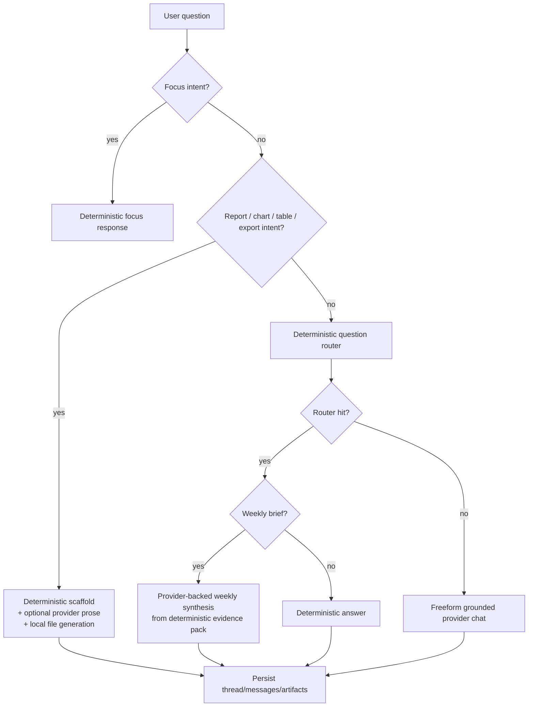
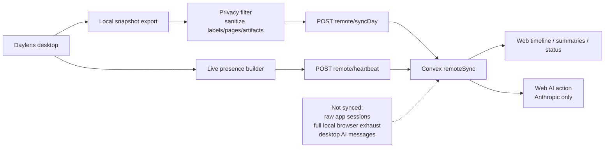
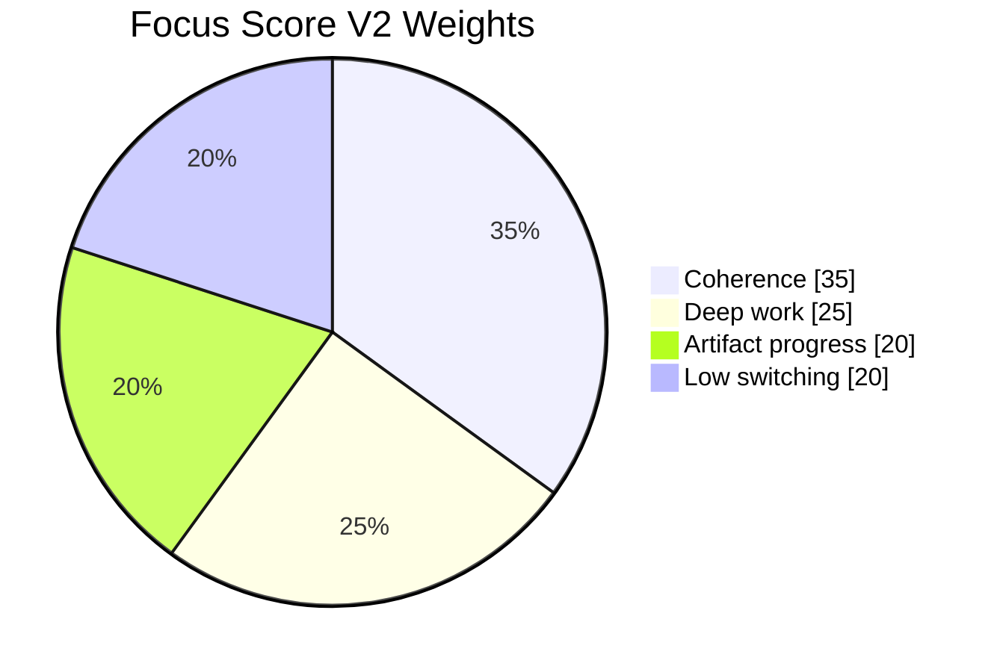

# Daylens Codebase Deep Dive

Last audited: 2026-04-23

This report is based on the current implementation in `daylens` and the adjacent `daylens-web` repo, not on older product docs.

## Executive Summary

Daylens is already a real local-first desktop work tracker with four live surfaces: `Timeline`, `Apps`, `AI`, and `Settings`. It persistently records foreground app/window sessions, browser history evidence on macOS and Windows, focus sessions, away/suspend state, reconstructed work blocks, local AI threads, and generated artifacts in SQLite plus the local user data folder.

The strongest parts of the product today are:

- local tracking and persistence
- deterministic timeline reconstruction
- a real AI orchestration layer in the desktop main process
- local artifact/report generation
- an opinionated but privacy-filtered desktop-to-web sync foundation

The weakest or least proven parts today are:

- packaged Windows and Linux runtime proof
- live linked-workspace behavior across real devices
- provider-backed AI quality outside test coverage
- desktop-to-web AI thread continuity
- enterprise-grade privacy/admin controls

The biggest strategic truth is this: Daylens is not "just an AI wrapper." The actual product is a local evidence engine with an AI layer on top. The AI is meaningful, but the core product value still comes from deterministic capture, reconstruction, and query scaffolding.

## 1. What The Product Is Right Now

### 1.1 Current Product Definition

- Code-proven: Daylens is an Electron desktop app with four top-level surfaces exposed in the renderer: `Timeline`, `Apps`, `AI`, and `Settings` (`src/renderer/App.tsx`, `src/renderer/components/Sidebar.tsx`).
- Inferred from code: The desktop app is the primary product; the web product is a companion proof surface and remote query surface, not the canonical source of truth.
- Needs runtime verification: Whether those four surfaces feel production-ready on packaged Windows and Linux builds.

#### Plain-English Summary

Right now, Daylens is a desktop app that quietly logs what you were doing on your machine, reconstructs that into work blocks, and lets you inspect that history through a timeline, an apps view, and an AI chat/report surface. It also has an optional linked workspace that sends a filtered version of the day to the web companion.

It is not currently a full cloud mirror of the desktop. It is also not a full enterprise analytics platform. The strongest truth is local evidence first, optional remote second.

#### Technical Detail

- App shell and routing live in `src/renderer/App.tsx`.
- Top-level navigation is enforced by `src/renderer/components/Sidebar.tsx`.
- Legacy routes redirect into current surfaces instead of expanding the IA.
- The main Electron process in `src/main/index.ts` owns startup, database initialization, tracking startup, sync startup, notifications, tray lifecycle, updater wiring, and IPC registration.
- The preload boundary in `src/preload/index.ts` exposes controlled APIs under `window.daylens`; the renderer does not directly talk to the filesystem, SQLite, or AI providers.
- `package.json` still carries the legacy package name `daylens-windows`, while the user-facing product name is `Daylens`. That mismatch is code-proven and still relevant operationally.

### 1.2 Main User-Visible Workflows

- Code-proven: Timeline, Apps, AI, Settings, onboarding gate, thread picker, recap cards, focus actions, and artifact open/export flows all exist in code (`src/renderer/views/Timeline.tsx`, `src/renderer/views/Apps.tsx`, `src/renderer/views/Insights.tsx`, `src/renderer/views/Settings.tsx`).
- Inferred from code: The intended primary loop is "track locally -> inspect timeline/apps -> ask AI -> generate shareable artifacts -> optionally sync a filtered view to web."
- Needs runtime verification: Which of these flows are stable in packaged builds across platforms and under real multi-day use.

#### Plain-English Summary

The product today gives a user these practical workflows:

| Workflow | What exists now |
| --- | --- |
| Passive tracking | Foreground app/window tracking plus browser history ingestion on macOS and Windows |
| Review | Timeline day reconstruction and app-centric views |
| Ask questions | AI chat with deterministic routing first and provider fallback second |
| Export | Markdown, CSV, and HTML artifacts generated locally |
| Focus | Focus session start/stop/review actions inside AI |
| Remote companion | Privacy-filtered day sync plus live presence to `daylens-web` |

#### Technical Detail

- `Timeline` uses reconstructed `DayTimelinePayload` from `src/main/services/workBlocks.ts`.
- `Apps` uses projection/query helpers over persisted timeline and artifact evidence.
- `AI` in `src/renderer/views/Insights.tsx` includes:
  - starter prompts
  - recap cards
  - freeform chat
  - thread list and delete
  - thumbs/copy/retry
  - focus-session actions
  - artifact preview/open/export
- `Settings` exposes real toggles for launch, sync, AI providers, notifications, appearance, privacy-adjacent controls, and category overrides.

## 2. End-To-End Architecture

### 2.1 Desktop App Structure

- Code-proven: Main process, preload bridge, and renderer are clearly separated (`src/main/index.ts`, `src/preload/index.ts`, `src/renderer/App.tsx`).
- Inferred from code: The architecture is deliberately backend-heavy inside the desktop app; the renderer is a client to local services, not the source of product logic.
- Needs runtime verification: Startup resilience and lifecycle edge cases in packaged builds.

#### Plain-English Summary

Daylens is structured like a local client/server app inside one desktop binary:

- the main process does the real work
- the preload layer exposes a safe bridge
- the renderer is the UI

That is the right shape for this product because tracking, database writes, AI provider calls, and sync should not depend on browser-tab-style UI state.

#### Technical Detail

- `src/main/index.ts` bootstraps:
  - single-instance behavior
  - user data path selection
  - DB init
  - settings init
  - background tracking
  - browser ingestion
  - sync
  - tray
  - updater
  - notifications
  - process monitor
  - IPC registration
- `src/preload/index.ts` exposes namespaced capabilities:
  - `db`
  - `ai`
  - `settings`
  - `tracking`
  - `focus`
  - `sync`
  - `analytics`
  - `navigation`
  - `updater`
  - more
- `src/renderer/*` consumes those APIs and renders surfaces.

### 2.2 Main Process vs Renderer vs Preload

- Code-proven: Provider SDK calls happen in the main process only (`src/main/services/ai.ts`).
- Inferred from code: This is a deliberate safety and product decision, not just an implementation accident.
- Needs runtime verification: Streaming smoothness and IPC performance under heavier use.

#### Plain-English Summary

The renderer never directly talks to OpenAI, Anthropic, Google, or the filesystem. That work happens in the main process. The preload layer is the controlled doorway between UI and system capabilities.

That matters because it keeps the timeline and AI grounded in local state, reduces accidental surface leakage, and makes the desktop app behave more like a real local application than a web page.

#### Technical Detail

- Main process responsibilities:
  - capture activity
  - read browser history DBs
  - write SQLite
  - build work blocks
  - run attribution/sessionization
  - call AI providers and CLIs
  - generate artifacts
  - upload privacy-filtered sync payloads
- Preload responsibilities:
  - expose typed IPC methods
  - prevent direct Node access from UI
- Renderer responsibilities:
  - render views
  - request data
  - stream chat deltas from IPC events

### 2.3 Database And Storage Model

- Code-proven: SQLite is the local source of truth, initialized in `src/main/services/database.ts` with WAL and foreign keys.
- Inferred from code: The schema is intentionally layered between raw-ish evidence, derived work context, AI persistence, and sync/export projections.
- Needs runtime verification: Database behavior after very long retention windows and real upgrade/migration histories.

#### Plain-English Summary

The desktop app stores almost everything locally in SQLite. Large generated artifacts are stored as files in the app's user data folder, while their metadata lives in SQLite.

This is not a stateless app. If the database is wrong, the product is wrong.

#### Technical Detail

Important local storage layers:

| Layer | Main tables / storage |
| --- | --- |
| Raw-ish capture | `app_sessions`, `website_visits`, `activity_state_events`, `focus_sessions` |
| Live state | `live_app_session_snapshot` |
| Reconstructed timeline | `timeline_blocks`, `timeline_block_members`, `timeline_block_labels` |
| Evidence and workflow | `artifacts`, `artifact_mentions`, `workflow_signatures`, `workflow_occurrences` |
| Attribution | `activity_segments`, `segment_attributions`, `work_sessions`, `daily_entity_rollups` |
| AI | `ai_threads`, `ai_messages`, `ai_artifacts`, `ai_surface_summaries`, `ai_usage_events`, `ai_conversations`, `ai_conversation_state` |
| Artifact files | `userData/artifacts/` and `userData/generated-reports/` |

Important nuance:

- some newer schema tables exist before full capture parity exists
- current live tracking writes `app_sessions`, `website_visits`, and related tables
- current live tracking does not appear to populate `raw_window_sessions`, `browser_context_events`, or `file_activity_events`

### 2.4 Core Services And How They Connect

- Code-proven: Core services are discrete and connected through the main process.
- Inferred from code: The architecture is drifting toward a local data platform with multiple derived consumers rather than one monolithic tracker function.
- Needs runtime verification: Background service interactions during sleep/wake, updater transitions, and first-run onboarding transitions.

#### Plain-English Summary

The main services are:

- tracking
- browser ingestion
- work-block reconstruction
- attribution/sessionization
- AI orchestration
- artifact persistence
- sync uploader
- settings and credentials

Each service is specialized. The product behavior comes from how they chain together, not from one magic model.

#### Technical Detail

High-signal service map:

| Service | Role |
| --- | --- |
| `src/main/services/tracking.ts` | Foreground app/window polling, idle/away handling, activity events |
| `src/main/services/browser.ts` | Browser history ingestion |
| `src/main/services/workBlocks.ts` | Timeline reconstruction, labels, artifacts, workflows |
| `src/main/services/attribution.ts` | Attribution-first entity/session pipeline |
| `src/main/services/ai.ts` | Main-process AI chat/report/artifact logic |
| `src/main/services/aiOrchestration.ts` | Provider routing and job policy |
| `src/main/services/artifacts.ts` | Durable AI artifact storage/open/export |
| `src/main/services/snapshotExporter.ts` | Local day snapshot export for sync and recap |
| `src/main/services/remoteSync.ts` | Privacy-filtered remote payload building |
| `src/main/services/syncUploader.ts` | Heartbeat and day sync to web |
| `src/main/services/workspaceLinker.ts` | Workspace create/link/recover/disconnect |

### 2.5 Mermaid System Diagram

- Code-proven: The following diagram matches the current service boundaries.
- Inferred from code: It omits lower-level helper modules for clarity.
- Needs runtime verification: Network and provider paths under failure conditions.



### 2.6 Mermaid Data-Flow Diagram

- Code-proven: This follows the capture-to-timeline path in current code.
- Inferred from code: It simplifies some helper query layers.
- Needs runtime verification: Timing drift and concurrency under long-running sessions.



### 2.7 Mermaid AI-Routing Diagram

- Code-proven: This reflects `src/main/services/ai.ts` and `src/main/services/aiOrchestration.ts`.
- Inferred from code: Streaming is shown at a conceptual level.
- Needs runtime verification: Real provider latency, CLI behavior, and follow-up quality.



### 2.8 Mermaid Desktop-To-Web Sync Diagram

- Code-proven: This reflects the current desktop sync uploader and web ingest path.
- Inferred from code: Browser auth/session details are simplified.
- Needs runtime verification: Multi-device freshness and recovery behavior.



## 3. Tracking And Evidence Collection

### 3.1 Foreground App And Window Tracking

- Code-proven: Foreground tracking is poll-based every 5 seconds in `src/main/services/tracking.ts`.
- Inferred from code: This is designed for robust broad evidence, not forensic-perfect event capture.
- Needs runtime verification: Accuracy under fast app switches and compositor-specific Linux sessions.

#### Plain-English Summary

Daylens checks which app/window is active every 5 seconds, keeps a live in-memory session, and writes completed sessions into SQLite. It also records when the machine looks idle, away, locked, suspended, or resumed.

This is practical evidence capture, not keystroke-level surveillance.

#### Technical Detail

`src/main/services/tracking.ts` does the following:

- polls active window on a `5_000 ms` interval
- persists live session snapshots every `15_000 ms`
- discards sub-10-second noise
- treats 2 minutes of no input as provisional idle
- treats 5 minutes of no input as away and flushes the session
- records:
  - app name
  - raw app name
  - bundle/executable identity
  - canonical app ID
  - app instance ID
  - window title
  - category
  - start/end times
  - ended reason
  - capture source

### 3.2 Browser History Ingestion

- Code-proven: Browser ingestion reads local browser history SQLite files and writes `website_visits` (`src/main/services/browser.ts`).
- Inferred from code: This is meant to provide page/domain evidence, not full browser session replay.
- Needs runtime verification: Data quality across multiple browser profiles and unusual browser states.

#### Plain-English Summary

Daylens does not inspect live browser tabs directly. Instead, it periodically reads browser history databases, estimates visit duration, and stores page-level evidence locally.

That means browser capture is real, but it is history-based, not live DOM capture.

#### Technical Detail

Current implementation:

- copies browser history DB + WAL + SHM to temp before reading
- polls every 60 seconds
- deduplicates by browser identity + visit timestamp + URL
- supports:
  - macOS: Chrome, Brave, Arc, Dia, Comet, Edge
  - Windows: Chrome, Edge, Brave, Arc, Dia, Comet, Firefox
  - Linux: no browser ingestion implemented in current code path

Stored fields include:

- full URL
- normalized URL
- domain
- page title
- estimated duration
- browser identity/profile info

### 3.3 What We Track

- Code-proven: The following data classes are actively written by current services.
- Inferred from code: The capture set is enough for meaningful work reconstruction, but not full attribution completeness.
- Needs runtime verification: Real-world data quality on days with unusual workflows.

#### Plain-English Summary

What Daylens really tracks today:

- active app sessions
- active window titles
- browser visit evidence
- idle/away/suspend/resume events
- focus sessions
- reconstructed work blocks
- AI threads and generated artifacts
- attributed client/project rollups when the attribution pipeline can resolve them

#### Technical Detail

Primary active evidence:

| Evidence type | Status |
| --- | --- |
| Foreground app/window sessions | Yes |
| Browser visit history | Yes on macOS and Windows |
| Idle/away/lock/suspend/resume | Yes |
| Focus session metadata | Yes |
| Reconstructed timeline blocks | Yes |
| Workflow signatures | Yes |
| Local AI threads/messages/artifacts | Yes |
| File activity/open/save events | Schema exists, active capture not found |
| Raw browser context events table | Schema exists, active capture not found |

### 3.4 What We Do Not Track

- Code-proven: No screenshot capture logic was found; no raw terminal command capture path was found.
- Inferred from code: Some sensitive strings can still appear incidentally through titles and paths.
- Needs runtime verification: Whether any third-party native dependency leaks more metadata than intended.

#### Plain-English Summary

What the current implementation does not appear to track:

- screenshots
- keystrokes
- clipboard contents
- raw terminal commands as a first-class capture stream
- Linux browser history
- true desktop-to-web AI message continuity

#### Technical Detail

Nuances:

- terminal usage is tracked only as app/window evidence like any other foreground app
- if a terminal window title contains a path or command-like text, that title can still be stored as a window title
- Daylens does not currently implement broad file-system activity tracking in the active capture path

### 3.5 Sensitive Fields: URLs, Titles, File Paths

- Code-proven: Full URLs and page titles are stored locally in `website_visits`; window titles are stored in `app_sessions`.
- Inferred from code: File paths are not broadly tracked as their own event stream, but can still appear in several local surfaces.
- Needs runtime verification: How often real-world window titles and paths expose more than intended.

#### Plain-English Summary

Local privacy is not "minimal metadata only." The local database can hold fairly sensitive evidence:

- full browser URLs
- page titles
- window titles
- generated artifact file paths

What is not implemented is a general "watch every file I touch" event stream.

#### Technical Detail

Important distinctions:

| Field | Local desktop | Synced web |
| --- | --- | --- |
| Full URLs | Yes | Intentionally reduced to domains / sanitized labels |
| Page titles | Yes | Intentionally not preserved as-is |
| Window titles | Yes | Not synced raw |
| File paths | Incidental / artifact paths / optional provider prompts | Intentionally filtered out from sync payloads |
| Raw browser history exhaust | Yes locally | No |

### 3.6 Platform Differences

- Code-proven: Tracking support varies by platform, especially on Linux (`src/main/services/tracking.ts`, `src/main/services/browser.ts`, `src/main/services/windowsHistory.ts`).
- Inferred from code: macOS and Windows are materially ahead of Linux for capture completeness today.
- Needs runtime verification: Real packaged parity on Windows and Linux.

#### Plain-English Summary

Platform parity is not fully symmetrical today.

- macOS: strong foreground tracking, browser history support
- Windows: strong foreground tracking, browser history support, some Windows history backfill
- Linux: foreground tracking is best-effort and browser history capture is currently absent

#### Technical Detail

Linux-specific notes:

- support is classified as `ready`, `limited`, or `unsupported`
- compositor-specific backends exist for:
  - Hyprland via `hyprctl`
  - Sway via `swaymsg`
  - X11/XWayland fallbacks via `xdotool` and `xprop`
- pure Wayland can remain limited or unsupported depending on environment

Windows-specific note:

- `src/main/services/windowsHistory.ts` backfills recent history from `ActivitiesCache.db`

### 3.7 Limits, Caveats, And Blind Spots

- Code-proven: Tracking is poll-based and browser capture is history-based.
- Inferred from code: Very short context switches and some native Wayland windows will be the main blind spots.
- Needs runtime verification: Error rates in long-running real user sessions.

#### Plain-English Summary

The product sees enough to reconstruct work, but not everything:

- very short switches can be missed or flattened
- browser timing is estimated
- Linux browser evidence is missing
- raw file activity is not yet a mature first-class stream

#### Technical Detail

Main blind spots:

- sub-poll-interval app changes
- browser tabs/pages that never become committed history entries
- file work hidden behind generic window titles
- native Wayland apps without a usable focused-window backend
- attribution quality when evidence is too thin to resolve a client/project

## 4. Timeline And Work-Block Reconstruction

### 4.1 How Timeline Days Are Built

- Code-proven: `getTimelineDayPayload()` in `src/main/services/workBlocks.ts` builds the day payload from sessions, websites, focus sessions, and activity events.
- Inferred from code: The timeline is reconstructed on demand and then persisted back into timeline tables as a derived layer.
- Needs runtime verification: Multi-month performance and live-session merge edge cases.

#### Plain-English Summary

The timeline is not just replayed from raw rows. Daylens loads the day's sessions and evidence, merges in the current live session if needed, reconstructs blocks, computes segments and gaps, and then persists those derived results.

That means the timeline is a computed proof surface, not a direct dump of raw capture.

#### Technical Detail

`getTimelineDayPayload()`:

1. loads `app_sessions` for the day
2. optionally merges the current live session
3. loads website summaries
4. builds work blocks
5. loads focus sessions
6. derives work/gap/away/machine-off segments
7. persists non-live timeline blocks and related evidence tables

### 4.2 How Work Blocks Are Formed

- Code-proven: Work blocks are formed by heuristic rules in `src/main/services/workBlocks.ts`.
- Inferred from code: The heuristics are opinionated toward coherent work stories rather than maximal splitting.
- Needs runtime verification: Whether the defaults feel right across many real users.

#### Plain-English Summary

Daylens tries to tell a sensible work story, not just cut the day every time the app changes. It merges coherent runs, splits long meetings out, preserves deep single-app streaks, and tries not to punish dev workflows that involve fast back-and-forth testing.

#### Technical Detail

Key thresholds in current code:

| Rule | Value |
| --- | --- |
| Idle gap threshold | 15 min |
| Standalone meeting threshold | 20 min |
| Long single-app streak | 45 min |
| Brief interruption | 3 min |
| Sustained different category split | 15 min |
| Communication interruption allowance | 5 min |
| Fast switch threshold | 5 min |
| Slow switch threshold | 15 min |
| Soft max timeline block span | 90 min |
| Hard max timeline block span | 2 h |

### 4.3 Context Switching And Interruptions

- Code-proven: Short passive interruptions are explicitly reclassified in `effectiveSessionsFor()`.
- Inferred from code: The product is trying to model "work continuity" rather than "literal foreground app history."
- Needs runtime verification: Whether users agree with the continuity decisions.

#### Plain-English Summary

Daylens does not treat every short interruption as a new task. It intentionally smooths some interruptions away when they look like noise around a continuing block of work.

#### Technical Detail

Current rule:

- a short `communication`, `email`, `entertainment`, or `social` interruption under 5 minutes
- between two sessions of the same surrounding category
- gets reclassified to the surrounding category for block formation

### 4.4 Productive App -> Spotify -> Productive App

- Code-proven: A short entertainment interruption can be absorbed into the surrounding block if it is under the threshold and bracketed by the same category.
- Inferred from code: A quick Spotify check during ongoing work will often stay inside the same work block.
- Needs runtime verification: How often this feels correct in practice.

#### Plain-English Summary

If the pattern is:

- productive work
- quick Spotify detour
- back to the same productive work

then Daylens is likely to keep that as one block rather than split it into three tiny stories.

#### Technical Detail

This happens through `effectiveSessionsFor()` before the main block analysis. It is not an AI guess. It is deterministic preprocessing.

### 4.5 What Data Shapes Feed The Timeline

- Code-proven: Timeline payloads combine sessions, website summaries, focus sessions, and activity events.
- Inferred from code: The timeline currently depends more on `app_sessions` and `website_visits` than on the newer raw/attribution schema tables.
- Needs runtime verification: How much attribution-derived data improves perceived timeline quality today.

#### Plain-English Summary

The timeline is mainly built from:

- app sessions
- browser visit summaries
- focus sessions
- away/suspend events

It is not currently powered by a mature file-activity stream.

#### Technical Detail

Important data feeds:

- `app_sessions` -> top apps, switch counts, categories, window titles
- `website_visits` -> domains, key pages, top pages
- `focus_sessions` -> focus overlap
- `activity_state_events` -> away, machine off, idle gaps
- persisted `timeline_blocks` -> app detail slices and workflow history

### 4.6 Deterministic Vs AI-Assisted Timeline Logic

- Code-proven: Block formation is deterministic; AI labels are optional and secondary.
- Inferred from code: This is one of the healthiest architecture choices in the codebase.
- Needs runtime verification: Quality and stability of background AI relabeling.

#### Plain-English Summary

The timeline works without AI. That is good. AI can help improve labels or narratives, but it is not the engine that makes the timeline exist.

#### Technical Detail

Label priority today:

1. user override
2. useful AI label
3. artifact-derived label
4. workflow label
5. useful rule label
6. fallback visible label

Background AI relabeling is conservative:

- skip live blocks
- skip user-overridden blocks
- only reopen clearly weak legacy AI labels or blocks without stable deterministic labels

### 4.7 Failure Modes And Weak Spots

- Code-proven: There are several likely weak spots visible in the heuristics and data sources.
- Inferred from code: The current approach is strong enough for a founder demo and early product use, but not yet robust enough to claim universal attribution truth.
- Needs runtime verification: All real-world false split / false merge complaints.

#### Plain-English Summary

The likely failure modes are:

- generic or weak window titles
- missing Linux browser evidence
- over-merging or under-splitting mixed work
- ambiguous entity attribution
- stale or weak AI labels on legacy blocks

#### Technical Detail

The most important weak spots are:

- browsing-heavy work with weak titles can still collapse into generic stories
- the system still depends heavily on category coherence and window-title usefulness
- invalidated timeline blocks accumulate as a derived-history layer rather than a clean overwrite

## 5. Focus Score

### 5.1 What The Score Is

- Code-proven: `computeFocusScoreV2()` in `src/main/lib/focusScore.ts` defines the current formula.
- Inferred from code: V2 is the score that matters strategically; the older score still exists for compatibility in some call sites.
- Needs runtime verification: Whether the score matches user intuition across different work styles.

#### Plain-English Summary

The new focus score tries to answer a practical question:

"Did this period look coherent, sustained, and artifact-producing, or did it look scattered?"

It is not just a raw "time in focused apps" percentage.

#### Technical Detail

Current formula:

```text
focus_score_v2 =
clamp01(
  0.35 * coherence
  + 0.25 * deep_work_density
  + 0.20 * artifact_progress
  + 0.20 * (1 - switch_penalty)
) * 100
```

### 5.2 Inputs And Weights

- Code-proven: Inputs and constants are explicit in `src/main/lib/focusScore.ts`.
- Inferred from code: The score is intentionally legible and explainable, not a black box.
- Needs runtime verification: Calibration against real users.

#### Plain-English Summary

The score rewards:

- longer coherent blocks
- more deep-work time
- more evidence/artifacts
- fewer app switches

#### Technical Detail

| Component | Weight | How it works | What helps | What hurts |
| --- | --- | --- | --- | --- |
| Coherence | 35% | Weighted mean block duration vs 45-minute target | Longer consistent blocks | Fragmented short blocks |
| Deep work density | 25% | Share of active time in blocks >= 25 min | Sustained sessions | Constant interruption |
| Artifact progress | 20% | Saturating function of unique artifacts, else window-title fallback | Real documents/pages/artifacts | Thin or generic evidence |
| Switch penalty | 20% | Penalty saturates at 20 switches/hour | Stable context | Rapid app switching |

Key constants:

- coherence target: 45 minutes
- deep-work block threshold: 25 minutes
- artifact saturation: 16 artifacts
- title fallback saturation: 10 unique window titles
- switch saturation: 20 switches/hour

### 5.3 Simple Weight Chart

- Code-proven: These percentages come directly from the formula.
- Inferred from code: This chart is explanatory, not a separate UI component.
- Needs runtime verification: Whether future tuning changes these weights.



### 5.4 Edge Cases

- Code-proven: Tests in `tests/focusScoreV2.test.ts` reveal non-obvious edge behavior.
- Inferred from code: The score is stable but has some surprising outcomes at the low end.
- Needs runtime verification: Whether those outcomes are acceptable product behavior.

#### Plain-English Summary

The most surprising edge case is this:

An empty input can still produce a score of `20/100`, because the low-switching term contributes even when there is no real work evidence.

That is mathematically consistent with the current formula, but it may not be what a user expects.

#### Technical Detail

Known edge cases:

- no blocks and no active time -> score floor can still land around 20
- unique window-title fallback can boost artifact progress even when explicit artifact extraction has not run
- switch penalty caps at 1, so beyond 20 switches/hour the score does not get worse on that dimension

## 6. AI Behavior And Routing

### 6.1 The Big Split: Deterministic First, Provider Second

- Code-proven: `src/main/services/ai.ts` routes deterministic paths before provider-backed chat.
- Inferred from code: This is the right product instinct and one of the best parts of the implementation.
- Needs runtime verification: Whether users can reliably feel the speed/quality difference.

#### Plain-English Summary

Daylens AI is not one thing. It has two distinct modes:

- deterministic/local logic for fast, grounded answers
- provider-backed AI for synthesis, prose, and open-ended requests

If you do not separate those two in your head, you will misunderstand the product.

#### Technical Detail

Current chat path:

1. focus intent check
2. direct report/output intent check
3. deterministic router
4. weekly brief provider synthesis if needed
5. deterministic answer if router can answer directly
6. full provider-backed grounded chat fallback

### 6.2 Fast Deterministic Responses

- Code-proven: Several flows return without provider calls.
- Inferred from code: These are the foundation for "Daylens feels real" instead of "wait for the model."
- Needs runtime verification: User-perceived quality of deterministic answers.

#### Plain-English Summary

Fast deterministic paths include:

- focus start/stop/review actions
- many stats/time-range/entity questions
- many recap/query scaffolds
- deterministic fallback summaries and reports

#### Technical Detail

Examples:

- `maybeHandleFocusIntent()` handles focus actions deterministically
- `routeInsightsQuestion()` answers many:
  - duration questions
  - app/site questions
  - compare-today-vs-yesterday questions
  - file/page/artifact questions
  - entity questions when attribution data exists
  - focus-score questions
- report generation can fall back to fully deterministic local export content if provider generation fails

### 6.3 Provider-Backed Responses

- Code-proven: Provider-backed jobs are defined in `src/main/services/aiOrchestration.ts`.
- Inferred from code: Providers are used mostly for synthesis and language quality, not for raw evidence retrieval.
- Needs runtime verification: Quality, latency, cost behavior, and failure handling under real credentials.

#### Plain-English Summary

Provider-backed AI is used when Daylens wants narrative quality, synthesis, or flexible conversation, not when it just needs to count or filter rows.

#### Technical Detail

Current provider-backed jobs include:

- `day_summary`
- `week_review`
- `app_narrative`
- `chat_answer`
- `chat_followup_suggestions`
- `report_generation`
- block labeling jobs
- attribution assist jobs

Supported provider types in desktop:

- Anthropic SDK
- OpenAI official SDK using the Responses API
- Google GenAI SDK
- Claude CLI
- Codex CLI

### 6.4 Which Flows Need Internet Or Provider Access

- Code-proven: API providers and provider validation require network access; CLI modes are supported separately.
- Inferred from code: CLI provider behavior may still depend on network indirectly depending on tool configuration.
- Needs runtime verification: Offline behavior and CLI-provider practical quality.

#### Plain-English Summary

These flows need internet or a reachable provider service:

- Anthropic/OpenAI/Google API chat
- provider-backed summaries
- provider-backed reports
- provider validation in Settings
- web AI in `daylens-web`

These do not necessarily need provider access:

- deterministic routing
- local timeline reconstruction
- local exports when provider prose generation fails

#### Technical Detail

`src/main/services/providerValidation.ts` actually calls:

- `https://api.anthropic.com/v1/models`
- `https://api.openai.com/v1/models`
- `https://generativelanguage.googleapis.com/v1beta/models`

### 6.5 Mocked, Template-Driven, Or Truly Dynamic

- Code-proven: Several outputs are scaffolded locally even when provider prose is used.
- Inferred from code: The product is best understood as "structured local generator + optional model prose," not as an open-ended autonomous file-making agent.
- Needs runtime verification: Whether users perceive that scaffolding as a limitation or a strength.

#### Plain-English Summary

Some Daylens AI outputs are truly dynamic, but many are structured by the product before the provider ever sees them.

That is a strength for groundedness, but it also means the system is less flexible than ChatGPT-style "make whatever file/tool output you want."

#### Technical Detail

Template-driven or scaffolded elements:

- day summary JSON scaffold
- weekly brief evidence pack
- deterministic follow-up candidates
- report/table/chart/export bundle building
- local CSV and HTML chart generation
- deterministic fallback report markdown

Truly dynamic parts:

- provider-written prose
- provider-written report markdown within the scaffold
- freeform chat fallback answers
- provider rewrite of follow-up suggestions

### 6.6 Chat Routing

- Code-proven: Chat routing lives in `src/main/services/ai.ts` and `src/main/lib/insightsQueryRouter.ts`.
- Inferred from code: The router is trying to convert common operator questions into fast evidence queries before paying model cost.
- Needs runtime verification: Coverage against the benchmark-style questions that matter most.

#### Plain-English Summary

The chat system tries hard not to send every question to a model. It first asks:

- is this a focus action?
- is this actually a report/export request?
- can I answer this from deterministic evidence?
- is this a weekly brief that needs synthesis?
- only then does it fall back to full provider chat

#### Technical Detail

Router capabilities include:

- date range inference
- client/project attribution-first answers
- duration and "how long" queries
- top app/site queries
- compare today vs yesterday
- files/docs/pages/artifacts queries
- weekly brief routing
- focus score answers

### 6.7 Follow-Up Suggestions

- Code-proven: Follow-up classification and fallback generation are deterministic first, with optional provider rewrite.
- Inferred from code: This keeps the UI from going blank when providers fail.
- Needs runtime verification: Whether the suggestions feel useful or repetitive in real use.

#### Plain-English Summary

Suggested follow-up chips are not purely model magic. Daylens can generate sensible fallback suggestions deterministically, then optionally improve them with a model.

#### Technical Detail

Key modules:

- `src/main/lib/followUpResolver.ts`
- `src/main/lib/followUpSuggestions.ts`

Behavior:

- detect whether context should be reused
- infer likely next questions from answer type
- optionally pass those through provider-backed refinement

### 6.8 Recap, Report, Export, And Artifact Generation

- Code-proven: Recap/report/export generation is real and local files are written to disk.
- Inferred from code: This is materially stronger than a chatbot that only prints text in a bubble.
- Needs runtime verification: Whether users find the output formats good enough without manual cleanup.

#### Plain-English Summary

Daylens can generate actual files, not just chat answers:

- Markdown reports
- CSV tables
- HTML charts

It does this by building deterministic evidence bundles locally, optionally asking a model to write better report prose, then writing the files itself.

#### Technical Detail

Flow:

1. detect requested output kinds from the question
2. build a local report bundle for:
   - day
   - week
   - client
   - project
   - app narrative
3. optionally ask a provider for structured JSON report prose
4. fall back to deterministic report content on failure
5. generate:
   - Markdown
   - CSV
   - HTML bar chart
6. write files to `userData/generated-reports`
7. persist artifact rows linked to the AI thread/message

### 6.9 SDKs Actually In Use

- Code-proven: The desktop repo uses official Anthropic, OpenAI, and Google SDKs plus CLI providers; the web repo uses Anthropic for web AI.
- Inferred from code: The stack is intentionally direct rather than abstracted through a universal chat SDK.
- Needs runtime verification: Whether this remains the final long-term provider architecture.

#### Plain-English Summary

Daylens is not using the Vercel AI SDK in the audited desktop or web codepaths.

#### Technical Detail

Desktop:

- `@anthropic-ai/sdk`
- `openai`
- `@google/genai`
- `claude` CLI
- `codex` CLI

Web:

- `@anthropic-ai/sdk`

Search result: no current `@vercel/ai`, `ai`, or Vercel AI SDK usage found in the audited repos.

### 6.10 Current Limitations Vs ChatGPT/Claude-Style File Generation

- Code-proven: Daylens generates specific artifact types from product-controlled scaffolds, not arbitrary tool-driven outputs.
- Inferred from code: This is safer and more grounded, but less open-ended.
- Needs runtime verification: Whether advanced users will push against this ceiling quickly.

#### Plain-English Summary

Daylens can generate useful local files, but it is not yet a general-purpose agent that can create arbitrary multi-file deliverables, execute rich tools, or maintain a sandboxed working directory the way ChatGPT/Codex/Claude coding products can.

#### Technical Detail

Current artifact ceiling:

- Markdown report
- CSV table
- HTML chart
- some JSON-style structured artifacts

Not currently present:

- arbitrary code execution as part of report generation
- spreadsheet formulas/workbooks
- slide decks
- multi-file project bundles
- provider-native file/tool calling loop for artifacts

## 7. Artifacts And Report Generation

### 7.1 How Artifacts Are Created

- Code-proven: Artifact creation and persistence live in `src/main/services/artifacts.ts` and `src/main/services/ai.ts`.
- Inferred from code: The artifact layer is already a meaningful product primitive, not just a message attachment hack.
- Needs runtime verification: Large artifact behavior and deletion/open/export ergonomics.

#### Plain-English Summary

Artifacts are durable objects. Daylens can create them, store them, reopen them later, export them, and link them back to the AI thread that created them.

#### Technical Detail

Artifact creation paths:

- generated report artifacts written by `writeGeneratedArtifacts()` in `src/main/services/ai.ts`
- durable artifact persistence via `createArtifact()` in `src/main/services/artifacts.ts`
- small artifacts stored inline in SQLite
- large artifacts stored as files with DB metadata rows

Inline threshold:

- `32 KB`

### 7.2 Where Artifacts Are Stored

- Code-proven: Artifact metadata is in SQLite; larger files live under user data directories.
- Inferred from code: Local artifact storage is already strong enough for a real user archive.
- Needs runtime verification: How well artifact cleanup works after long-term usage.

#### Plain-English Summary

Artifacts live in two places:

- database row for metadata
- local file path for larger content

#### Technical Detail

Storage locations:

- SQLite table: `ai_artifacts`
- file directory: `userData/artifacts/`
- generated export directory: `userData/generated-reports/`

### 7.3 How Artifacts Link To AI Threads

- Code-proven: Artifacts are linked to thread and message IDs and persisted after assistant turns.
- Inferred from code: This is the start of a durable "AI workspace memory" model, even though desktop/web continuity is incomplete.
- Needs runtime verification: Thread deletion behavior under heavy artifact usage.

#### Plain-English Summary

Artifacts are attached to the specific AI conversation turn that created them. This means report generation is part of the AI product, not a separate export subsystem pretending to be AI.

#### Technical Detail

Linkage fields:

- `thread_id`
- `message_id`
- artifact kind
- title
- mime type
- byte size
- metadata JSON

Desktop threads also carry `workspaceThreadId` metadata for possible future cross-surface identity, but full desktop message sync is not implemented.

### 7.4 Artifact Kinds That Exist Today

- Code-proven: Artifact kinds are explicit in code.
- Inferred from code: The set is useful but still narrow.
- Needs runtime verification: Which kinds users actually use most.

#### Plain-English Summary

Current artifact kinds are enough for work recap and reporting, but not a broad document-generation platform.

#### Technical Detail

Current kinds include:

- `report`
- `markdown`
- `csv`
- `html_chart`
- `json_table`
- `focus_session`

### 7.5 What Could Be Standardized Further

- Code-proven: Artifact generation is real but somewhat hand-built across flows.
- Inferred from code: There is room for a stronger artifact contract.
- Needs runtime verification: Which standardization investments would matter most to real users.

#### Plain-English Summary

The artifact system works, but it still feels like a set of good product moves rather than a fully normalized document platform.

#### Technical Detail

Best standardization targets:

- shared artifact schema for previews and metadata
- stronger distinction between "analysis artifact" and "shareable deliverable"
- richer artifact types like spreadsheet/workbook outputs
- artifact provenance fields showing which evidence rows drove the output
- optional remote artifact sync policy by artifact type

## 8. Data Retention And Scale

### 8.1 What The Code Suggests About Retention

- Code-proven: No active runtime retention-pruning job was found in the audited capture paths.
- Inferred from code: Local history is intended to accumulate rather than expire quickly.
- Needs runtime verification: How large real databases become after quarters or years.

#### Plain-English Summary

The code behaves like a product that intends to keep local history for a long time. I did not find a real "delete old tracking data after X days" policy in the current runtime path.

#### Technical Detail

What I did find:

- SQLite with WAL
- derived rollups such as `daily_entity_rollups`
- invalidation of old `timeline_blocks` when recomputed

What I did not find:

- routine pruning of old `app_sessions`
- routine pruning of old `website_visits`
- compression/archive jobs for raw history

### 8.2 Raw Vs Derived Data

- Code-proven: The schema distinguishes raw-ish and derived layers.
- Inferred from code: Derived layers are additive, not replacements for raw history.
- Needs runtime verification: Whether this becomes too heavy without compaction.

#### Plain-English Summary

Daylens keeps both the evidence and the reconstructed story. That is good for truthfulness, but it also means storage grows in multiple layers.

#### Technical Detail

| Raw-ish or base evidence | Derived / summarized |
| --- | --- |
| `app_sessions` | `timeline_blocks` |
| `website_visits` | `workflow_signatures` / `workflow_occurrences` |
| `activity_state_events` | `activity_segments` |
| `focus_sessions` | `work_sessions` |
| AI messages/artifacts | `daily_entity_rollups` |

Important nuance:

- `timeline_blocks` are invalidated and replaced, not hard-overwritten in place
- this preserves derived history state but can add row growth over time

### 8.3 Realistic Local Retention Horizon

- Code-proven: The app is architected for long-lived local storage, but no hard limits are encoded.
- Inferred from code: Months and likely years are plausible for a single-user SQLite installation, but this is still an inference, not a benchmark.
- Needs runtime verification: Database size, rebuild speed, and UI responsiveness after long retention windows.

#### Plain-English Summary

My honest read is:

- months: likely fine
- quarters: probably fine
- years: plausible for a single user, but not proven

The risk is not "SQLite cannot do it." The risk is "derived rebuilds, text-heavy evidence, and no pruning/compaction strategy will eventually make some operations heavier."

### 8.4 Likely Scaling Bottlenecks

- Code-proven: The current design creates some obvious growth hotspots.
- Inferred from code: These will matter before raw compute becomes the problem.
- Needs runtime verification: Which bottleneck hits first in real usage.

#### Plain-English Summary

The likely scale bottlenecks are not fancy model issues. They are:

- lots of browser-history rows
- lots of text-heavy titles and URLs
- repeated timeline recomputation
- accumulating invalidated timeline rows
- local artifact files piling up

#### Technical Detail

Most likely pressure points:

- `website_visits`
- `app_sessions`
- `timeline_blocks` plus invalidated old rows
- `artifact_mentions`
- `ai_messages` and `ai_artifacts`
- day rebuild queries over larger date ranges

## 9. Web And Sync

### 9.1 How Desktop Data Reaches The Web

- Code-proven: Desktop sync uses `src/main/services/syncUploader.ts` plus `src/main/services/remoteSync.ts`.
- Inferred from code: The web companion is fed by a filtered export path, not by raw desktop replication.
- Needs runtime verification: End-to-end normal-user reliability.

#### Plain-English Summary

The desktop app exports a local day snapshot, strips it down to a privacy-filtered remote payload, and posts that to the web backend. Live presence is sent separately on a faster heartbeat.

#### Technical Detail

Desktop sync path:

- local snapshot export via `src/main/services/snapshotExporter.ts`
- privacy rewrite via `src/main/services/remoteSync.ts`
- upload via `src/main/services/syncUploader.ts`

Network paths:

- `remote/heartbeat`
- `remote/syncDay`

### 9.2 What Convex Is Doing

- Code-proven: Convex stores synced day summaries, blocks, entities, artifacts, live presence, and web AI threads/messages.
- Inferred from code: Convex is currently both the remote sync store and the web-AI application backend.
- Needs runtime verification: Operational stability under real linked workspaces.

#### Plain-English Summary

Convex is doing three jobs:

- storing synced desktop day data
- serving web timeline/status APIs
- powering a separate web AI layer

#### Technical Detail

Key server files in `daylens-web`:

- `convex/remoteSync.ts`
- `convex/ai.ts`
- `convex/webAiThreads.ts`
- `convex/snapshots.ts`

### 9.3 What Is Synced And What Is Intentionally Not Synced

- Code-proven: The desktop sync payload is aggressively filtered.
- Inferred from code: Privacy filtering is a first-class design decision, not a later patch.
- Needs runtime verification: Whether the filtered web data is still useful enough day to day.

#### Plain-English Summary

Synced:

- day summaries
- work blocks
- entities
- artifact rollups
- live presence

Not synced:

- raw app session exhaust
- full local browser history exhaust
- full page titles and URLs as-is
- full desktop AI thread/message history

#### Technical Detail

Current remote filtering includes:

- scoping block IDs and artifact IDs per device
- dropping block `artifactIds`
- reducing top-page labels to domain-only labels
- generating a safe recap
- syncing AI artifacts only as rollups, not full desktop conversations

### 9.4 Shared Contract

- Code-proven: The shared contract is defined through `@daylens/remote-contract` and validated in both repos.
- Inferred from code: This shared contract is already a serious architectural asset.
- Needs runtime verification: Drift control across future changes.

#### Plain-English Summary

Desktop and web are not talking through ad hoc JSON blobs. They already share a real contract. That is strategically important if you want this product to become trustworthy across surfaces.

#### Technical Detail

Important shared shapes include:

- `RemoteSyncPayload`
- `WorkspaceLivePresence`
- synced day summaries
- work block summaries
- entity rollups
- artifact rollups

### 9.5 Live Presence Path

- Code-proven: Heartbeat interval is 15 seconds.
- Inferred from code: This is intended for "is the linked machine alive and what is it doing now?" not for exact minute-perfect observability.
- Needs runtime verification: Staleness UX and reconnect behavior.

#### Plain-English Summary

Live presence is a lightweight pulse:

- current state
- current app/category label
- focus seconds
- heartbeat timestamps

It is not full live desktop mirroring.

### 9.6 Day-Sync Path

- Code-proven: Dirty-day sync runs every 60 seconds and also on tracking-triggered debounce and quit.
- Inferred from code: The day is treated as the durable sync unit.
- Needs runtime verification: Sync freshness and conflict behavior across devices.

#### Plain-English Summary

Remote sync is day-based, not event-stream-based. The desktop marks a day as dirty and re-uploads a filtered summary of that day.

#### Technical Detail

Intervals:

- heartbeat: 15 seconds
- day sync: 60 seconds
- tracking-triggered debounce: 20 seconds

Additional sync triggers:

- startup delayed kick
- quit
- previous-day finalization

### 9.7 APIs And Routes That Exist Now

- Code-proven: The following web routes are live in code.
- Inferred from code: They are product-facing endpoints, not yet a clean general external API.
- Needs runtime verification: Auth/session behavior under real deployments.

#### Plain-English Summary

Current web routes are enough for the product, but not yet shaped like a public enterprise API.

#### Technical Detail

Current web routes:

| Route | Purpose |
| --- | --- |
| `/api/snapshots` | Get one day, a range, or summaries; `?full=1` hits legacy full snapshot path |
| `/api/chat` | Ask web AI about synced data |
| `/api/workspace-status` | Get linked-workspace status |

Desktop service endpoints used by the app:

- `createWorkspace`
- `recoverWorkspace`
- `createLinkCode`
- `remote/heartbeat`
- `remote/syncDay`

### 9.8 What Would Need To Change For A Clean Enterprise API

- Code-proven: The current remote model is product-specific and device-scoped.
- Inferred from code: Enterprise API work would require more than documentation cleanup.
- Needs runtime verification: Which enterprise use cases matter most first.

#### Plain-English Summary

To become a real external API, Daylens would need more than simply exposing current product routes. It would need cleaner identity, privacy tiers, versioning, and stable non-device-scoped contracts.

#### Technical Detail

Most important changes:

- stable external auth model
- explicit API versioning
- pagination and filtering semantics
- non-device-scoped stable work block IDs
- raw-vs-sanitized data tiers
- admin controls over sync scope and retention
- desktop AI thread/message sync if cross-surface AI continuity is part of the product claim

### 9.9 Desktop-To-Web AI Continuity

- Code-proven: Full desktop AI thread/message sync is not implemented.
- Inferred from code: The current architecture leaves room for it but does not yet deliver it.
- Needs runtime verification: None; this is currently a code-level gap, not just a runtime uncertainty.

#### Plain-English Summary

This is important enough to say plainly:

Desktop-to-web AI continuity is not done.

The web app has its own AI thread/message system in Convex. The desktop app has its own local AI thread/message system in SQLite. Some artifact rollups carry workspace thread IDs, but the full conversation does not sync.

## 10. Privacy And Enterprise Readiness

### 10.1 Current Privacy Boundaries

- Code-proven: Local data stays on-device unless sync is linked or provider-backed AI is used; analytics are opt-in; keys are stored in the OS credential vault.
- Inferred from code: Daylens is privacy-minded but not yet privacy-simple.
- Needs runtime verification: Real-world user understanding of what is local vs sent.

#### Plain-English Summary

Today the privacy story is:

- rich evidence stays local by default
- remote sync is filtered
- telemetry is off by default
- provider-backed AI can send grounded evidence out to providers

That is decent, but it is not the same as "nothing sensitive ever leaves the machine."

#### Technical Detail

Key boundaries:

- local SQLite stores sensitive evidence
- provider keys live in keytar / secure store
- analytics only send sanitized safe properties when opted in
- Sentry is sanitized and opt-in with PII disabled
- sync payload is intentionally privacy-filtered

### 10.2 Sensitive Data Risks

- Code-proven: Sensitive strings exist locally and provider redaction defaults are off.
- Inferred from code: The biggest current privacy risk is not telemetry; it is local evidence richness and optional provider grounding.
- Needs runtime verification: How often provider prompts include data users would consider too sensitive.

#### Plain-English Summary

The real privacy risks today are:

- full URLs in local DB
- page titles and window titles in local DB
- optional provider prompts that may contain grounded evidence
- no enterprise-grade policy layer yet

#### Technical Detail

Important defaults:

- `analyticsOptIn = false`
- `aiRedactFilePaths = false`
- `aiRedactEmails = false`

That means provider-backed AI is privacy-aware in architecture, but not conservative by default on these two redaction knobs.

### 10.3 Settings That Matter Most For Privacy

- Code-proven: These settings exist and are wired.
- Inferred from code: The product still lacks finer-grained privacy controls.
- Needs runtime verification: Whether users can actually understand and trust these controls.

#### Plain-English Summary

The most meaningful privacy-related controls today are:

- analytics opt-in
- AI file-path redaction
- AI email redaction
- workspace link/disconnect
- provider connection and validation
- third-party website icon fallback

#### Technical Detail

Privacy-adjacent controls with real code usage:

- `analyticsOptIn`
- `aiRedactFilePaths`
- `aiRedactEmails`
- `allowThirdPartyWebsiteIconFallback`
- workspace link/create/recover/disconnect flows

### 10.4 What Should Happen Before Selling To Teams / SMEs / Enterprises

- Code-proven: Several gaps are visible directly in code.
- Inferred from code: Enterprise-readiness is a product/program gap more than a one-file engineering gap.
- Needs runtime verification: Which customers care most about which boundary.

#### Plain-English Summary

Before selling this seriously to teams or enterprises, I would want:

- clearer capture policy controls
- better redaction defaults
- admin and retention controls
- stronger remote API identity
- proven Windows/Linux runtime
- a sharper answer on desktop/web AI continuity

#### Technical Detail

Priority gaps:

| Gap | Why it matters |
| --- | --- |
| Fine-grained data collection controls | Needed for privacy commitments |
| Retention policy controls | Needed for compliance and admin confidence |
| Team/admin auth model | Current model is workspace-link oriented, not enterprise admin oriented |
| Stable external API contract | Current routes are product-specific |
| Enterprise audit trail | Needed for trust and governance |
| Stronger provider policy layer | Needed for BYO key, allowed models, and data boundary clarity |
| Cross-platform packaged proof | Needed before broad rollout claims |

## 11. Settings And Controls Audit

### 11.1 Which Settings Are Real And Used

- Code-proven: Many settings in `src/main/services/settings.ts` are actively consumed elsewhere.
- Inferred from code: Settings are already product-relevant, not decorative filler.
- Needs runtime verification: Whether users discover and understand them well.

#### Plain-English Summary

The Settings screen is not fake. It exposes real controls that affect launch, sync, AI routing, notifications, privacy-adjacent behavior, and category mapping.

#### Technical Detail

Clearly used settings include:

- `launchOnLogin`
- `theme`
- `aiProvider`
- provider-specific models
- fallback order
- provider-per-job choices
- `aiPromptCachingEnabled`
- `aiBackgroundEnrichment`
- `dailySummaryEnabled`
- `morningNudgeEnabled`
- `distractionAlertsEnabled`
- `distractionAlertThresholdMinutes`
- `analyticsOptIn`
- `allowThirdPartyWebsiteIconFallback`

### 11.2 Which Settings Look Underused

- Code-proven: Some settings exist in storage/UI with limited visible downstream use in the audited code.
- Inferred from code: These may be early-stage controls or future-proofing hooks.
- Needs runtime verification: Whether they matter in current user flows.

#### Plain-English Summary

Some settings look more "prepared" than deeply integrated.

#### Technical Detail

Most notable candidates:

- `aiActiveBlockPreview`
- `aiSpendSoftLimitUsd`
- `aiModelStrategy`

These are real settings, but they do not appear as deeply woven into runtime policy as the provider-per-job routing and core provider choices.

### 11.3 Which Settings Are Mostly Launch / Setup Controls

- Code-proven: Some settings are mostly lifecycle/setup state rather than everyday controls.
- Inferred from code: That is fine, but they should not be confused with product depth.
- Needs runtime verification: None beyond UX quality.

#### Plain-English Summary

Some settings matter mainly at setup time:

- onboarding completion/state
- first launch metadata
- provider connection
- workspace link/recovery
- launch on login

### 11.4 Which Areas Likely Need Expansion

- Code-proven: Gaps are visible in current settings coverage.
- Inferred from code: The next settings work should be privacy, retention, and sync-governance oriented, not decorative.
- Needs runtime verification: Which controls users actually ask for first.

#### Plain-English Summary

The next settings expansion should probably not be visual fluff. It should focus on:

- capture boundaries
- sync scope
- retention
- provider privacy policies
- enterprise controls

## 12. Final Sections

### 12.1 Top 10 Most Important Truths About This Codebase

- Code-proven: All points below are grounded in the audited implementation.
- Inferred from code: Ordering reflects product importance, not just engineering neatness.
- Needs runtime verification: Only where explicitly called out in each point.

1. Daylens is already a real local evidence product, not just an LLM UI.
2. The desktop main process is the real backend of the product.
3. SQLite is the source of truth; if persistence breaks, the product breaks.
4. Timeline reconstruction is deterministic and AI is intentionally secondary there.
5. Browser evidence on macOS and Windows is real and locally stored, including full URLs and titles.
6. Linux parity is materially weaker today, especially for browser capture.
7. The AI stack is multi-path: deterministic router first, provider synthesis second.
8. Artifact/report generation is real and local, but constrained to product-shaped outputs.
9. Remote sync is intentionally privacy-filtered and does not mirror the full desktop evidence store.
10. Desktop-to-web AI continuity is still not implemented.

### 12.2 Top 10 Decisions I Can Now Make Better Because I Understand This

- Code-proven: These decisions follow directly from the architecture and gaps above.
- Inferred from code: These are operator decisions, not claims that the product must do all of them immediately.
- Needs runtime verification: Prioritization should still be checked against live user behavior.

1. I can evaluate Daylens as a local data product first and an AI product second.
2. I can stop claiming cloud parity that the code does not currently deliver.
3. I can prioritize Linux/browser-capture truthfulness instead of pretending parity exists.
4. I can invest in privacy controls where the real risk is: local rich evidence and provider grounding.
5. I can decide whether desktop/web AI continuity is truly core or just tempting scope.
6. I can decide whether to standardize artifacts into a stronger document layer.
7. I can decide whether to productize the attribution-first entity layer more aggressively.
8. I can choose to build an enterprise API only after fixing identity, versioning, and stable IDs.
9. I can tune focus score and timeline heuristics as explicit product policy, not opaque model behavior.
10. I can judge launch readiness by proof layers: local capture, persistence, reconstruction, provider behavior, sync, and packaged-runtime validation separately.

### 12.3 Top 10 Unanswered Questions That Still Need Live Validation

- Code-proven: These questions remain unanswered by static code inspection alone.
- Inferred from code: These are the highest-signal unknowns for launch and positioning.
- Needs runtime verification: Yes, all ten.

1. How reliable is linked-workspace sync over normal multi-device daily use?
2. How fresh and understandable is stale/failure sync UX in the real product?
3. How well do provider-backed chat answers perform against benchmark-style work questions?
4. How stable are packaged Windows builds in normal use?
5. How usable is Linux tracking across real desktop environments beyond dev machines?
6. Do users agree with the current block-merge/split heuristics over long usage windows?
7. Does the focus score feel intuitively fair, especially around low-data edge cases?
8. How often do raw local URLs/titles create privacy discomfort once users understand what is stored?
9. Is the privacy-filtered web view useful enough without full desktop fidelity?
10. Do users actually want desktop-to-web AI continuity badly enough to justify the added privacy and sync complexity?

## Closing Read

If I had to describe the codebase in one sentence:

Daylens today is a serious local work-evidence engine with a thoughtful AI orchestration layer, a real but filtered remote companion, and a handful of very important truthfulness gaps that should be handled by validation and product discipline rather than by more marketing language.

If I had to describe the next strategic move in one sentence:

Do not add more surface area until the product's strongest claims are fully proven across capture, reconstruction, privacy boundaries, sync reliability, and desktop/web continuity.
