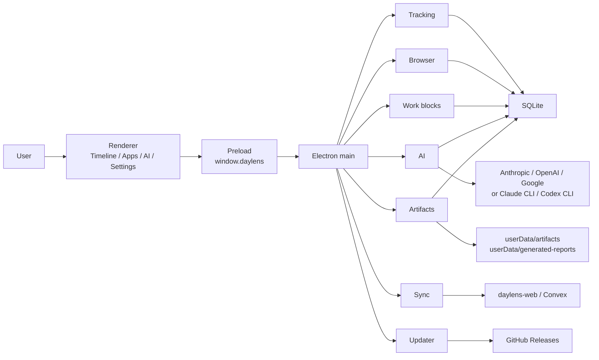
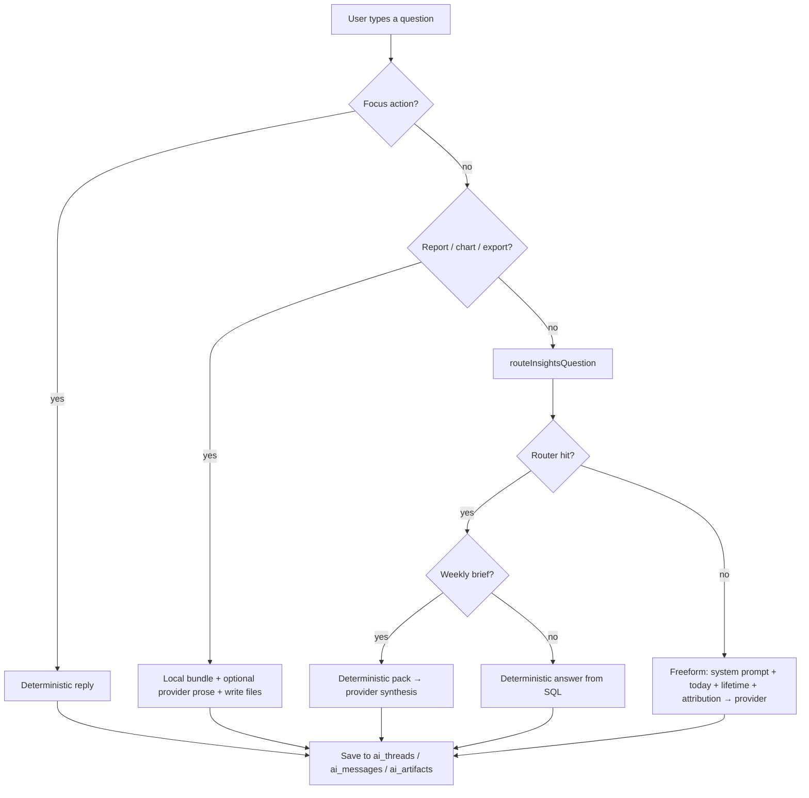
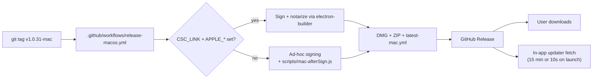

# Daylens — User Journey Walkthrough

Last audited: 2026-04-23. Traces what the code actually does at each step a user takes, from clicking Download to using the AI. Replaces the section-by-section audit.

Tags: `[proven]` visible in code, `[inferred]` reasonable read, `[unverified]` not provable without runtime. `[gap]` = code-proven missing behavior.

---

## Step 1 — User clicks "Download" on the website

**What happens**

The download page at `https://christian-tonny.dev/daylens` (the URL is hard-coded in `src/main/services/updater.ts:12` as the manual-download fallback) links to GitHub Releases on `irachrist1/daylens` (`updater.ts:14-15`).

The Release itself was produced by `.github/workflows/release-macos.yml` when someone pushed a tag matching `v*-mac`. The workflow:

1. Derives version from the tag.
2. Stamps `package.json` version.
3. `npm ci --ignore-scripts` + `electron-rebuild` native modules.
4. Detects signing mode: `developer-id` if `CSC_LINK` + `CSC_KEY_PASSWORD` secrets exist, else `adhoc`.
5. `npm run typecheck` + `build:all` (Vite bundles).
6. `electron-builder --mac zip dmg` — produces DMG + ZIP + `latest-mac.yml` updater metadata.
7. `softprops/action-gh-release@v2` uploads the assets to a GitHub Release tagged `v<version>`.

**What's automated vs manual** `[proven]`

| Step | Automated? |
| --- | --- |
| Build DMG/ZIP from tagged commit | Yes |
| Generate release notes from CHANGELOG.md + commit log | Yes |
| Upload to GitHub Releases | Yes |
| Create the `v*-mac` tag | **Manual** (you push it) |
| Update christian-tonny.dev/daylens page with new version | **Manual** — the static page isn't in this repo |
| Windows / Linux releases | Separate workflows (`release-windows.yml`, `release-linux.yml`) triggered by their own tags |

**Gotcha:** The website download page is static. If you ship a new version and don't touch the page, users clicking Download get whatever URL is hard-coded there. The in-app updater, though, always fetches directly from GitHub Releases — so it's self-healing. `[inferred]`

---

## Step 2 — User installs on macOS

**What happens today (ad-hoc signing path)** `[proven]`

Daylens does not have an Apple Developer ID certificate, so the release workflow took the `adhoc` branch. That branch runs `scripts/mac-afterSign.js`, which runs:

```
codesign --force --deep --sign - <Daylens.app>
```

That produces a complete ad-hoc signature. Without this hook, electron-builder's fallback stub produces a `CodeDirectory` that claims resources it never writes, and Gatekeeper marks the DMG as **"damaged and can't be opened."** With the hook, the user instead sees the standard **"unidentified developer"** dialog — annoying but recoverable.

Today's user flow:
1. Open DMG, drag to Applications.
2. Double-click → "Daylens cannot be opened because the developer cannot be verified."
3. Open System Settings → Privacy & Security → scroll to the Daylens entry → **Open Anyway**.
4. Re-launch, confirm once more, app starts.

**What changes with Apple notarization** `[inferred from workflow logic]`

The workflow already auto-detects mode. Adding `MAC_CERTIFICATE_FILE`, `MAC_CERTIFICATE_PASSWORD`, and the `APPLE_API_*` / `APPLE_ID` / `APPLE_APP_SPECIFIC_PASSWORD` / `APPLE_TEAM_ID` secrets flips the branch at `release-macos.yml:82-90` — electron-builder then signs with the real Developer ID and notarizes. On first launch users see **one** dialog ("Apple verified this app") and click Open. No System Settings detour.

The ad-hoc `mac-afterSign.js` hook becomes redundant once notarized — you can leave it; it's a no-op on non-adhoc builds because electron-builder's own signing runs first.

---

## Step 3 — First launch (before onboarding)

**What the main process boots** `[proven]` — `src/main/index.ts`

1. Single-instance lock (second launch focuses the existing window).
2. Select `userData` path. On macOS this is `~/Library/Application Support/Daylens/`.
3. Open SQLite (`daylens.sqlite`) with WAL + foreign keys.
4. Run migrations from `src/main/db/migrations.ts`.
5. Read settings from electron-store (not SQLite — settings live in `config.json` in userData).
6. Start **tracking** (`tracking.ts`) — poll active window every 5s, even during onboarding.
7. Start **browser ingestion** (`browser.ts`) — poll every 60s on macOS/Windows.
8. Start **sync uploader** if a workspace is linked.
9. Register IPC handlers, build tray, set up updater.
10. 10 seconds later: `autoUpdater.checkForUpdates()` (`updater.ts:649-652`).

**Important:** tracking begins at step 6, before the user has clicked through onboarding. On macOS without Screen Recording permission, the active-window API returns only the app name (no window title), so evidence is thin until permission is granted.

---

## Step 4 — Onboarding

Onboarding state lives in `settings.onboardingState` (electron-store), not SQLite. The renderer gates on `shouldShowOnboarding()` (`onboarding.ts:67-69`).

### Stages `[proven]` — `shared/types.ts:739-745`, `Onboarding.tsx`

| Stage | What it does | Where data lands |
| --- | --- | --- |
| `welcome` | Copy + timeline preview mock | none |
| `permission` (macOS only) | Opens System Settings → Privacy → Screen Recording. Renderer polls `getTrackingPermissionState()` every few seconds. | `settings.onboardingState.trackingPermissionState` |
| `relaunch_required` (macOS) | macOS only hands permission to an app after relaunch. User clicks restart. | same |
| `verifying_permission` | Intermediate while system state settles | same |
| `proof` | Waits for the first real work evidence (live session + timeline payload). | Read from SQLite live, not stored in onboarding state |
| `personalize` | Shows 4 goal chips, all optional | `settings.onboardingState.personalization` |
| `complete` | Closes onboarding, renders Timeline. | `settings.onboardingComplete = true` |

### What's captured at "Personalize" `[proven]` — `Onboarding.tsx:679-710`

Only **goals** (a set of up to 4 chip selections). The user can click **Skip** and the app still finishes.

### Name capture — **not implemented** `[gap]`

- `settings.userName: string` exists (`settings.ts:27`, `shared/types.ts:801`).
- The AI chat prompt reads it (`ai.ts:3895-3898`, `ai.ts:1941`) and builds a personalized persona line *if it's set*.
- **No UI anywhere writes to it.** Grep confirms: zero references in `Onboarding.tsx`, `Settings.tsx`, or `Insights.tsx`.
- Net effect: the persona line is always the generic "embedded in a local screen-time tracker" fallback.

Either wire a name input to the personalize step (cheap) or delete the unused field (also cheap).

---

## Step 5 — User lands on Timeline

**What the view does** `[proven]` — `src/renderer/views/Timeline.tsx`, `src/main/services/workBlocks.ts`

The renderer calls `ipc` → `getTimelineDayPayload(date)` in the main process. `getTimelineDayPayload()`:

1. Loads today's `app_sessions` from SQLite.
2. Merges the current live session.
3. Loads website summaries.
4. Calls `effectiveSessionsFor()` — **this is where "work → Spotify → work" gets smoothed** (short communication/entertainment interruption between same-category bookends gets reclassified).
5. Builds blocks with thresholds: 15 min idle gap, 20 min standalone meeting, 45 min long streak, 90 min soft max, 2 h hard max.
6. Loads focus sessions.
7. Persists non-live blocks back to `timeline_blocks`.

**AI's role here: none by default.** The timeline reconstructs entirely from SQL rows and deterministic rules. AI only touches block labels if `aiBackgroundEnrichment` is enabled (Settings), and only on clearly-weak labels (skips live blocks, user-overridden blocks, and stable deterministic labels) — see `ai.ts:3650`, `ai.ts:3684`, `ai.ts:3703`.

### Label priority `[proven]`

```
user override  >  AI label  >  artifact-derived  >  workflow  >  rule-based  >  fallback
```

**Renaming a block** writes a user override. That override is the highest priority and is never touched again by AI or reconstruction. The underlying block keeps its evidence; only the display label changes.

---

## Step 6 — User clicks Apps

**What the view does** `[proven]` — `src/renderer/views/Apps.tsx`, `src/main/db/queries.ts:671-690`

The Apps list and per-app totals come from one SQL query that runs over the time range the user selected (1 / 7 / 30 days):

```sql
SELECT
  app_sessions.bundle_id,
  MIN(app_sessions.app_name) AS app_name,
  COALESCE(category_overrides.category, MIN(app_sessions.category)) AS category,
  SUM(MIN(COALESCE(end_time, start_time + duration_sec * 1000), ?) - MAX(start_time, ?)) AS total_seconds
FROM app_sessions
LEFT JOIN category_overrides ON category_overrides.bundle_id = app_sessions.bundle_id
WHERE ...
GROUP BY bundle_id
```

Then `liveAwareSummaries()` in the renderer adds the current live session on top (`Apps.tsx:36-73`).

**AI's role: none.** Pure SQL + a sort. Per-app detail panels add artifact, paired-app, and block-appearance data from related tables — still deterministic. `[proven]`

---

## Step 7 — User opens AI and asks a question

This is the part that's been hardest to read from the top level. Here's the actual flow, in order.

### The routing decision tree `[proven]` — `src/main/services/ai.ts`

When the user submits a chat message, `sendAIMessage()` runs:

1. **Focus intent check** — `maybeHandleFocusIntent()`. If the question is "start a focus session", "end focus", "how's focus going?" — answered deterministically, no provider.
2. **Output intent check** — did the user ask for a report / chart / table / CSV / export? If yes, builds a local report bundle (day / week / client / project / app narrative), optionally calls a provider for better prose, falls back to a deterministic markdown if the provider fails, writes files to `userData/generated-reports/`, persists artifact rows. One provider call possible, but the bundle and files are assembled locally.
3. **Deterministic router** — `routeInsightsQuestion()` (`src/main/lib/insightsQueryRouter.ts`). Answers many common questions directly from SQL:
   - "how long on Figma this week?"
   - "top apps today"
   - "compare today vs yesterday"
   - "what did I do for ClientX?" (if attribution data exists)
   - "what's my focus score?"
4. **Weekly brief path** — if the router classifies the question as a weekly brief, it builds a deterministic evidence pack first, then calls a provider to synthesize prose over that pack.
5. **Freeform fallback** — everything else goes to a provider with the full system prompt + today's context + lifetime context + attribution context.

**So: deterministic → deterministic → deterministic → provider-synthesis-over-pack → provider-freeform.** Most short operator questions never leave step 3.

### Where the system prompts live `[proven]`

All in `src/main/services/ai.ts`:

| Prompt | Line | Used for |
| --- | --- | --- |
| Day summary | 2564-2585 | The opening recap card |
| Weekly brief | 2817-2898 | Weekly synthesis |
| App narrative | 3177-3203 | Per-app story in Apps view |
| Follow-up suggestions | 3310-3343 | Chip rewrites |
| Report generation (day/week/client/project) | 3481-3533 | Structured JSON for reports |
| Weekly brief prompts (`weeklyBriefPrompts`) | 3808 | The weekly path |
| **Main chat system prompt** | **3904-3935** | Freeform AI chat |

### What the main chat prompt actually contains `[proven]` — `ai.ts:3887-3935`

The prompt the provider sees is built from these parts, joined in order:

1. **Persona line** — uses `userName` if set, else generic fallback. (Dead because no UI sets `userName`.)
2. **Behavior rules** — ~20 lines on how to think (work sessions first, attribution-first for entity questions, grounding contract, don't invent file names, use time ranges) and how to write (2-5 sentences, direct "you", never "the user", say "looks like" when ambiguous).
3. **Model disclosure line** — "If asked what model is powering this chat: say you are Daylens, currently routed through `<providerLabel>` (`<model>`)."
4. **Lifetime tracked data** — output of `buildAllTimeContext()` (`ai.ts:1850-1907`). Last 2 years of data, pre-aggregated into plain text:
   - Tracking window (days).
   - Lifetime tracked time + focused %.
   - Top 5 categories with durations.
   - Top 10 apps with durations.
   - Top 10 sites with durations.
   - Distraction total (YouTube, X, Instagram, Reddit, TikTok, Netflix, Facebook).
5. **Today's tracked data** — output of `buildDayContext()` (`ai.ts:1909+`). Today's app summaries, sessions, websites, derived work evidence, peak hours, focus score.
6. **Specific historical context** — only if the question referenced a specific date/range.
7. **Attribution day context** — today's attributed work sessions as JSON, if any.
8. **Attribution entity context** — if the question mentioned a client/project name.

All seven parts are plain text concatenation. There's no vector search, no retrieval, no tool calling.

### Token sizes `[proven]`

| Direction | Cap | Where |
| --- | --- | --- |
| Output | Anthropic: `max_tokens: 1024` | `ai.ts:866` |
| Output | OpenAI: `max_output_tokens: 1024` | `ai.ts:903` |
| Output | Google: similar | in `sendWithGoogle` |
| Input | **No explicit cap** | context is concatenated as-is |

The system prompt for a typical day is a few KB of plain text. Lifetime context is also small because it's pre-aggregated (top-10 style), not raw session rows. So input tokens stay modest despite no cap — `[inferred]`, but this is where silent cost drift could hide if the aggregators ever got less strict.

### Streaming and the CLI path `[proven]`

- All three SDKs stream: `client.messages.stream` (Anthropic, `ai.ts:864`), `store: false, stream: true` (OpenAI, `ai.ts:904-906`), similar for Google.
- Deltas flow to the renderer via IPC events.
- CLI providers (`claude`, `codex`) don't accept a separate system prompt, so `ai.ts:1113` prepends `System context:\n${systemPrompt}\n\n${existingCLIPrompt}` into the user prompt.
- Prompt caching (Anthropic) is handled in `src/main/services/anthropicPromptCaching.ts` and gated by `aiPromptCachingEnabled`.

### Follow-up chips `[proven]`

After a response, `generateSuggestedFollowUps()` runs. It produces deterministic candidates from answer type + temporal context, then optionally asks a provider to rewrite them for better phrasing. If the provider fails or is off, the deterministic candidates ship as-is — the UI never goes blank.

### Artifacts from AI

When the user asks for a report/chart/CSV, files land in `userData/generated-reports/` (.md / .csv / .html). Metadata row in SQLite table `ai_artifacts` links them to the thread + message. Inline threshold: 32 KB (anything smaller is stored as a blob in SQLite; larger becomes a file + metadata row). `[proven]`

---

## Step 8 — User opens Settings and clicks "Check for updates"

**What happens** `[proven]` — `src/main/services/updater.ts:430-465`

1. Renderer calls IPC `update:check`.
2. Main calls `autoUpdater.checkForUpdates()` (electron-updater).
3. electron-updater fetches `latest-mac.yml` (or `latest.yml` / `latest-linux.yml`) from the most recent GitHub Release.
4. Compares the version there to `app.getVersion()`.
5. Fires one of: `update-available`, `update-not-available`, `error`.

### The macOS ad-hoc twist `[proven]` — `updater.ts:62-84, 293-408`

Squirrel.Mac (what electron-updater delegates to on Mac) verifies that the downloaded bundle matches the running app's **designated requirement** — which includes cdhash and Team ID. Ad-hoc signed builds have neither. So `autoUpdater.quitAndInstall()` always fails on ad-hoc Mac.

The code detects this (`isMacAdhocSigned()`) and switches paths:

1. Sets `autoUpdater.autoDownload = false` — state stops at `available`.
2. User clicks Install → `performAdhocMacInstall()`:
   - Downloads `Daylens-<version>-<arch>.zip` directly from `github.com/irachrist1/daylens/releases/download/v<version>/`.
   - Extracts with `ditto` to tmp.
   - Writes a detached bash script that: waits for the running process to exit → `rm -rf` the old `/Applications/Daylens.app` → `mv` the staged bundle into place → `codesign --force --deep --sign -` → strip quarantine `xattr` → `open -n` to relaunch.
   - Calls `app.quit()` 250ms later.
3. The detached script runs after Daylens dies, swaps the bundle, relaunches.

When Daylens is notarized, this whole branch goes away. `canUseElectronUpdaterInstall()` returns true, `autoDownload = true`, `autoInstallOnAppQuit = true`, and the standard Squirrel path works.

### Windows and Linux `[proven]`

- **Windows**: standard Squirrel.Windows path. SmartScreen warns until the installer is code-signed with reputation. If `latest.yml` isn't published for a version, the UI says so explicitly — don't silently swallow the 404.
- **Linux**: package-type aware. AppImage, DEB, and RPM are supported. Pacman detected but not published yet — updater returns `supported: false` with a clear message.

### The 10-second auto-check `[proven]`

`updater.ts:649-652` schedules one background check 10 seconds after the window exists. So users see an update banner without clicking anything, *if* the platform supports updates.

---

## Background loops running the whole time `[proven]`

While the user clicks around, these run continuously:

| Loop | Interval | File |
| --- | --- | --- |
| Active window poll | 5 s | `tracking.ts` |
| Live session snapshot write | 15 s | `tracking.ts` |
| Browser history ingestion | 60 s | `browser.ts` |
| Live presence heartbeat (if workspace linked) | 15 s | `syncUploader.ts` |
| Day sync (if workspace linked) | 60 s + 20s debounce on tracking events | `syncUploader.ts` |
| Idle detection (provisional / flushed) | 2 min / 5 min | `tracking.ts` |
| AI background relabel (if enabled) | debounced, on block changes | `ai.ts:3650-3703` |

---

## Where things are likely to fail (debugging lens)

| Symptom | Most-likely cause | Where to look |
| --- | --- | --- |
| "Daylens is damaged" dialog on Mac | afterSign hook didn't run | `scripts/mac-afterSign.js`, check `codesign -dv` on the bundle |
| "Unidentified developer" dialog | Normal for ad-hoc build | Expected until Apple notarization is added |
| Timeline is empty after onboarding | Screen Recording permission not actually granted | `getTrackingPermissionState()`, macOS Privacy settings |
| AI says "I only have today's data" | `buildAllTimeContext()` returned empty (no apps+sites) | `ai.ts:1857`; check `app_sessions` exists |
| AI invents project names | Freeform path; grounding rule violated by the model | `ai.ts:3910-3918` (grounding clause), consider a stronger output-intent hit |
| Focus score shows ~20 with no work | Low-switching term contributes at zero input | `focusScore.ts`, `tests/focusScoreV2.test.ts` |
| "Check for updates" returns error on Win | `latest.yml` missing from the Release | release workflow output or GitHub Release assets |
| Mac update downloads but doesn't install | Ad-hoc swap script failed silently | `/tmp/daylens-swap-*.log` |
| Empty AI persona ("embedded in a…") | `userName` never captured — gap | `ai.ts:3895`; no UI writer exists |
| Web timeline stale | Day sync failure; 60s interval | `syncUploader.ts`, `syncState.ts` |

---

## What looks trimmable

Honest candidates based on this read:

1. **`settings.userName`** — no UI writer. Either wire a name input into the `personalize` stage or delete the field + the two prompt branches in `ai.ts:1941`, `ai.ts:3895-3898`.
2. **Schema tables with no live writer** — `raw_window_sessions`, `browser_context_events`, `file_activity_events` exist but nothing populates them today. Either start writing, or drop the migrations to shrink the schema surface.
3. **Legacy full-snapshot web path** — `/api/snapshots?full=1` exists but the normal sync path doesn't feed it. Likely dead if the linked-workspace path is canonical.
4. **Older focus score call sites** — V1 formula still referenced in some places; V2 is the strategic one. Consolidate.
5. **`mac-afterSign.js`** — becomes a no-op once notarization is added. Safe to keep (cheap insurance), but remove if you want clean separation.
6. **`aiActiveBlockPreview`, `aiSpendSoftLimitUsd`, `aiModelStrategy`** settings — real keys, not deeply wired. Delete or finish wiring.

None of these are urgent. They're real dead-ish weight, but small.

---

## Full-picture diagrams







---

## What's still unverified

Nothing in this doc is aspirational, but these need live checks:

1. Linked-workspace sync reliability across a normal multi-device day.
2. Packaged Windows and Linux runtime on real machines.
3. Provider-backed chat quality with real credentials and benchmark-style questions.
4. The ad-hoc Mac swap script under edge cases (non-/Applications install, read-only volume, running from DMG).
5. How large `buildDayContext()` gets on a very long day — it currently has no cap.
6. Whether users hit the "Gatekeeper damaged" state in the wild because of an edge case the afterSign hook didn't cover.
